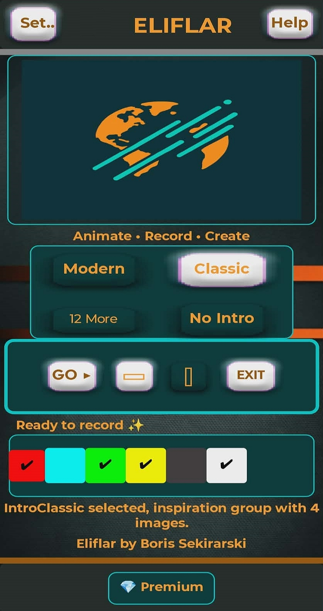

# 🛰️ ELIFLAR: Live Video Creator

  
  <h1>ELIFLAR</h1>
  
<strong>Animate • Record • Create • Share Instantly</strong>

  
  
<i>The fastest way to turn your ideas into narrated videos—no editing required.</i>

  

---

### 🚀 Stop Editing. Start Presenting.
**Eliflar** is a powerful live production studio in your pocket. Whether you are explaining weather patterns, archaeological findings, or product reviews, Eliflar lets you narrate and animate your story in real-time. 

**Record your voice, draw live effects, and your video is ready to post the moment you stop recording.**

---

### 🌍 Live Data Showcase (Automation)
This repository serves as a real-time data hub. Our Python-driven servers process and push global atmospheric maps every hour, showcasing Eliflar's capability for professional data visualization.

> [!TIP]
> **Dynamic Insight:** Below is the one of our latest European forecast map, we can update automatically regularly here or on any other web location by our automated backend.

---

### ✨ Key Features for Everyone
- **Zero-Editing Workflow:** Your recording is your final product. No post-production needed.
- **Live Flare & Drawing:** Drag dynamic color flares and highlights while you speak to emphasize key details.
- **Professional Intros:** Choose from a library of cinematic intros (Classic, Modern, News) to give your video a "broadcast" feel.
- **Full Slide Control:** Manage transitions and timing in real-time for a perfect flow.
- **100% Privacy:** All processing is done locally. We never access your private gallery, files, or cloud storage.

---

### 💎 Premium Benefits
- **Full Color Palette:** Unlock unlimited flare and UI customization for your brand.
- **Pro Exports:** Remove all watermarks for clean, professional-grade content.
- **Exclusive Library:** Access to premium "NoText" intro versions for a minimalist look.

---

### 🛠️ Technical Ecosystem
- **Backend:** Python 3.8.10 (Automated GRIB/NetCDF & Image processing)
- **Deployment:** GitHub Sync & Cloud Data Automation
- **Regional Focus:** Balkan & European Data visualization.

---

### 📜 License & Terms
**Developer:** Boris Sekirarski  
**EULA:** By downloading and using Eliflar, you are granted a non-exclusive license for personal or commercial video creation. Reverse engineering or unauthorized redistribution of the APK is strictly prohibited.

---

  
Developed with ❤️ in North Macedonia

  
<strong>Official Hub: <a href="http://eliflar.app">eliflar.app</a></strong>

